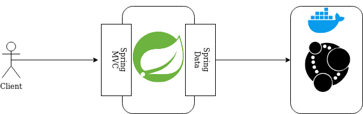

# Neo4JavaRecommendationService

This is a simple web service developed in order to demonstrate the usage of Spring Data for Neo4j.

The service exposes the following entry points:
* `POST /customer`: Customer creation
* `GET /customer/:id`: Retrieves customer having the provided id
* `POST /product`: Product creation
* `GET /product/:id`: Retrieves product having the provided id
* `PUT /customer/:customerId/product/:productId`: Register a purchase made by a customer
* `GET customer/{customerId}/product`: Retrieves products purchased by the customer
* `GET customer/{customerId}/recommended`: Retrieves products purchased by customers that purchased the same products of the given customer

### Architecture Overview

### Implementation details
* For the data layer I used the latest Docker image of Neo4j exposing ports
7867 and 7474.
* Java version: 8

